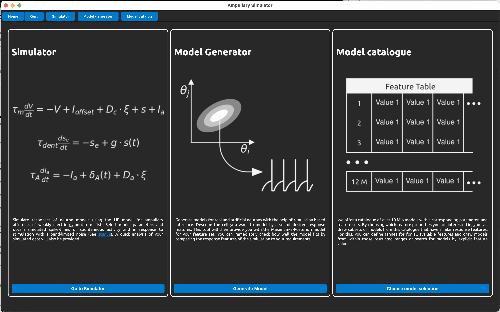

# Ampullary Simulator

Tools for creating models of ampullary afferents of South American wave-type electric fishes. In particular of the species *Apteronotus leptorhynchus* and *Eigenmannia virescens*.

It uses the [simulation based inference](https://sbi.readthedocs.io/en/stable/) approach to generate models.

The model and the SBI network for mapping between cell features and model parameters was developed by Sarah Mayer and Jan Grewe of the Neuroethology group at the University of Tübingen, Germany. 

## License

This is open source software with absolutely no warranty.
See [license](license.md) for details.

The code is available on [github](https://github.com/bendalab).

## Citing

If you use this tool for your research please reference our paper 

Mayer et al., 2026

```bib
@article{Mayer2026,
  author = {Mayer, Sarah and Benda, Jan and Grewe, Jan},
  year = {2026}
}
```

The original data and related python code are available in our [GIN repository](https://gin.g-node.org/jgrewe)


## Getting started

<!--  -->


### The UI provides a set of tools to:

* [simulate](simulator.md) single ampullary afferents with user-specified model parameters.
* [generate](modelgenerator.md) individual models from the SBI network with specified response features.
* [generate populations](modelcatalog.md) of cell models by specifying feature ranges.

