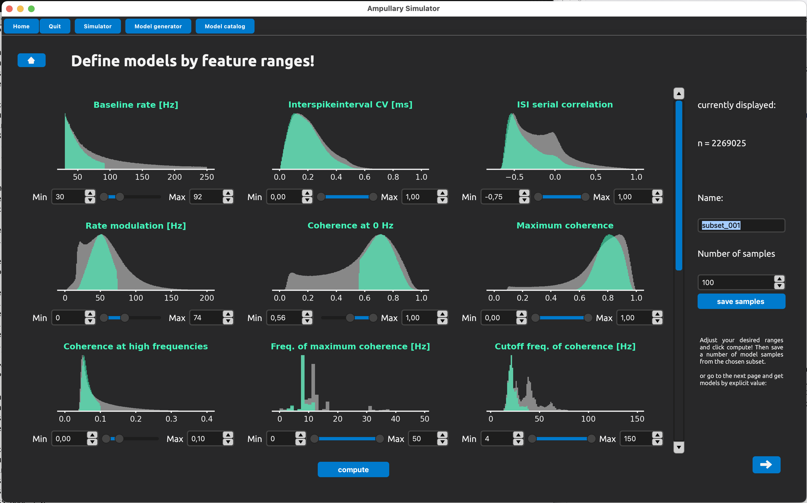
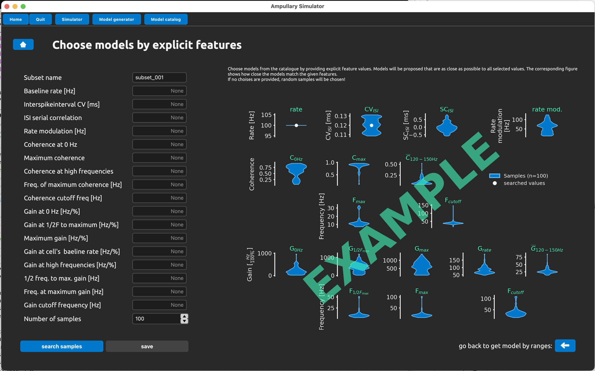

# Model populations from the training catalog

Generate a population of models that have randomly selected features.

The gray histograms show the distribution of model response features in the training set with which the SBI network was trained.

With the sliders beneath each histogram, you can specify the range of responses features into which the generated models should fall.

On the right you can specify how many cell models should be generated.

## Model populations with specific features

Specify a set of response features and generate a set of models and see how well they match the requirements.