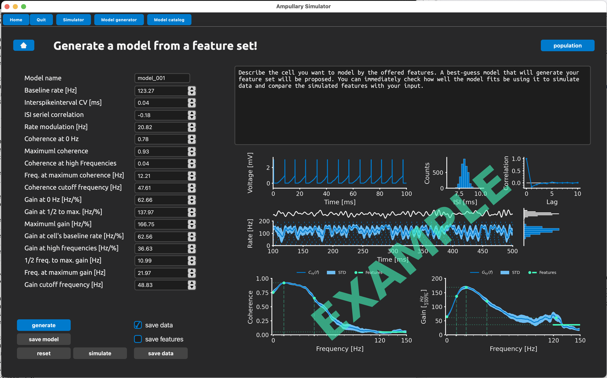
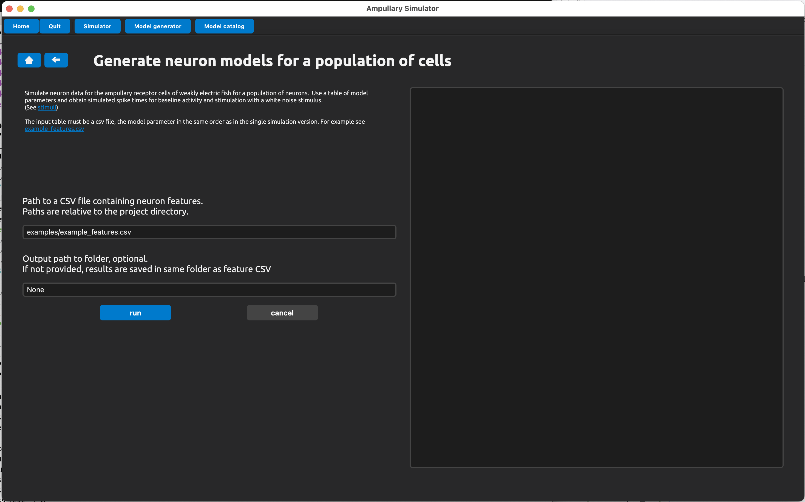

# Model generator

Generate models by specifying a unique set of response features.

On the left side, you can specify the desired response features of the model. 

Upon pressing the *generate* button, the best-matching model parameters will be retrieved from the SBI network and, if wanted, one can *simulate* baseline and stimulus driven responses to test the resulting model parameters with our standard stimuli. The results will be shown in the figure on the right.

## Generate populations of models

Instead of a single set of response features, provide a csv table with feature sets and get a model for each.