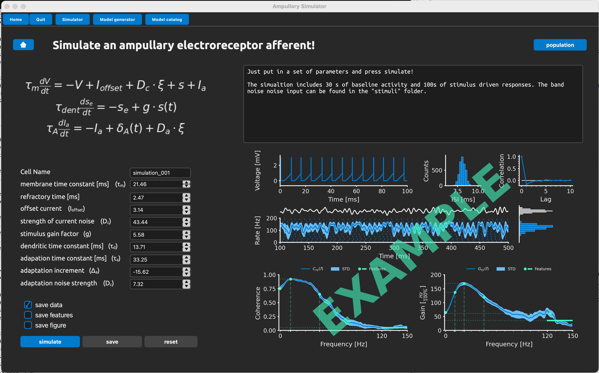
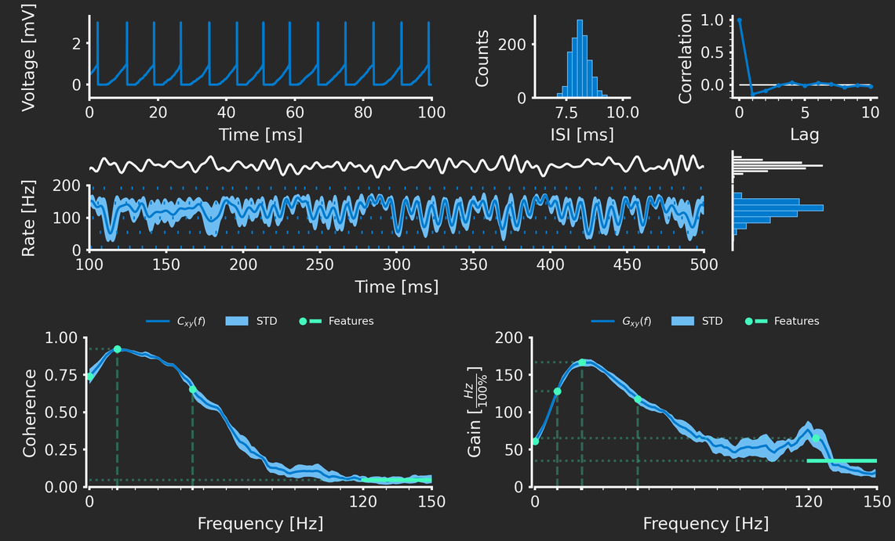
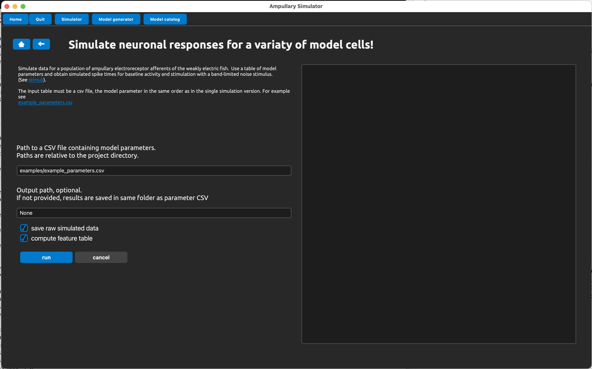

# Simulator

This interface allows to simulate cellular responses by providing model parameters.

This is great for getting a feeling of the model.

The two main parts of the UI are the grid of spin-boxes on the left to specify the model parameters, and the figure showing the resulting response properties.

## Running the simulation will take a little time

Just press the button *simulate* and the model will generate 30s of spontaneous activity and responses to band-limited noise (150Hz cutoff), evaluate the responses and generate the figure.

Depending on your hardware this may take some time (< 1 minute).

The resulting data and figure can be saved to disk.

## Figure explanations

The top row depicts features of the baseline activity in the absence of an external stimulus.

Middle row shows a short section of the noise response.

Bottom plots show the stimulus-response coherence and the gain of the transfer function.

For details see our [paper]().

## Simulating populations of neurons

Using this UI, you can simulate populations of neurons. The model parameters must be stored in a csv table.
